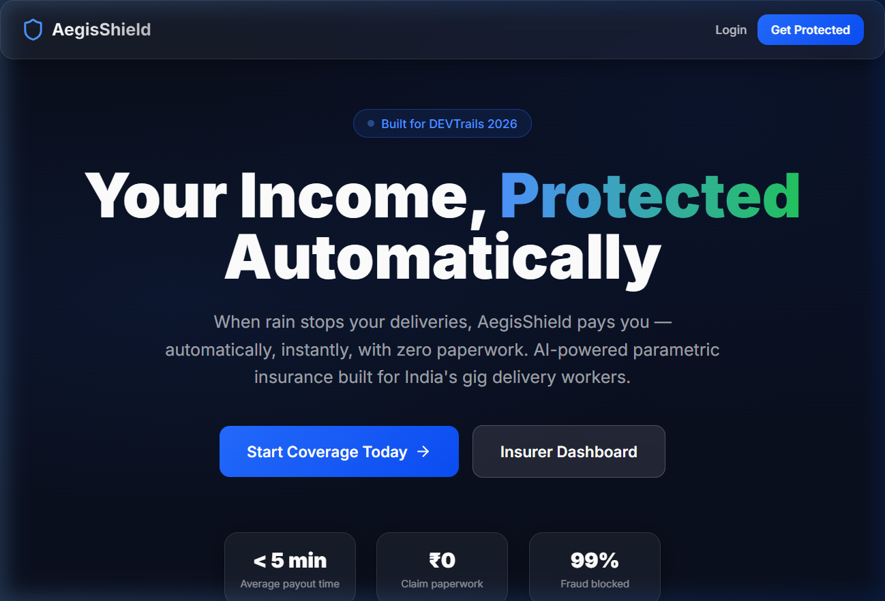
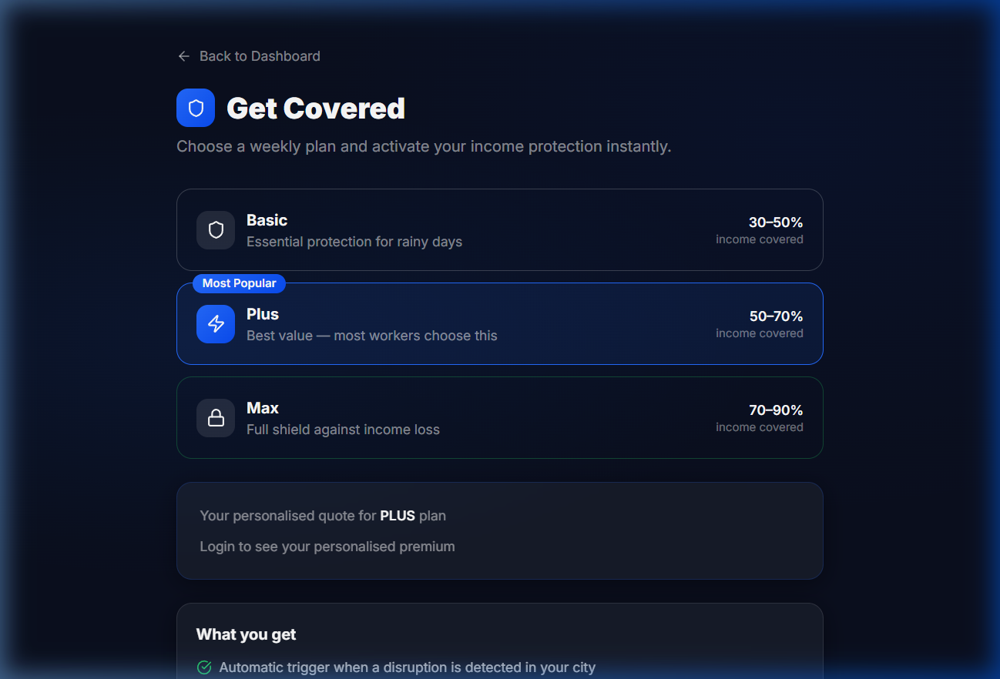
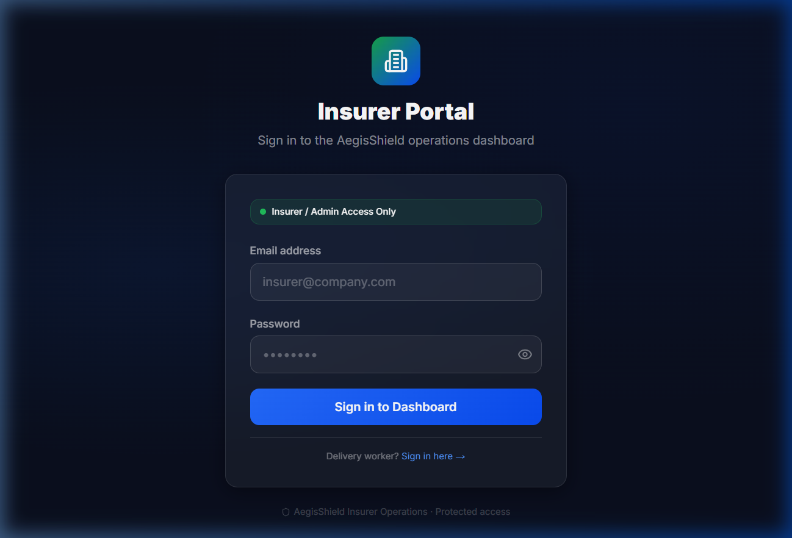

<div align="center">
  
# 🛡️ AegisShield
**AI-Powered Parametric Income Protection for Gig Delivery Workers**

[](https://opensource.org/licenses/MIT)
[](https://www.typescriptlang.org/)
[](https://nextjs.org/)
[](https://nestjs.com/)
[](https://fastapi.tiangolo.com/)

*Built fast. Defended hard. Never going bankrupt. Built for DEVTrails 2026.*

</div>

---

## 📖 The Vision

India’s platform-based delivery partners (Zomato, Swiggy, Zepto, Amazon, Flipkart, Dunzo) keep the digital economy running, yet lose 20–30% of their monthly income when external disruptions like extreme weather, pollution, floods, app outages, or sudden curfews wipe out their working hours. They absorb this loss alone, with no income safety net.

**AegisShield** is an AI-enabled, parametric insurance platform that automatically protects a delivery worker’s **weekly income** from such uncontrollable events. We deliver **zero-touch claims**, **instant payouts**, and **aggressive fraud defenses** designed to survive market-crash scale attacks.

---

## 📸 Platform Overview

<div align="center">
  
  <br>
  <em>Landing page optimized for conversion and clarity.</em>
</div>

<br>

<div align="center" style="display: flex; gap: 10px; justify-content: center;">
  
  
</div>
<div align="center">
  <em>Left: Live policy quotes & tier selection. Right: Secure Insurer/Admin login portal.</em>
</div>

---

## 🎯 Scope & Golden Rules

- **Target Persona**: Food Delivery Partners operating in dense urban areas, paid on weekly cycles, highly sensitive to weather and curfews.
- **LOSS OF INCOME ONLY**: We insure **lost hours/wages** when a worker is unable to work due to external disruptions. 
- **Strictly Excluded**: Health, life, or accident coverage. Vehicle repair, medical bills, or damage claims.

---

## ⚙️ Core Architecture & Features

### 1. Weekly Pricing Model
Gig workers live on a week-to-week cycle. AegisShield is priced on a **per-week subscription basis**. The AI-driven dynamic pricing engine calculates premiums based on:
- City/zone risk (flood-prone vs historically safe)
- Usual working hours (night-heavy vs day-only)
- Seasonality (monsoon vs clear season)
- Historical disruption exposure and claim patterns

### 2. Parametric Triggers (Zero-Touch Claims)
We don't wait for workers to "file" claims. We auto-trigger payouts based on:
- **Environmental Triggers**: Rainfall/flood alerts, extreme heat, severe AQI.
- **Social/Operational Triggers**: Unplanned curfews, local strikes, app outages.
- **Income Impact Condition**: Worker must be scheduled/available, and actual earnings must drop significantly below their expected baseline for that window.

### 3. AI/ML Components
- **Risk Profiling & Weekly Premium Prediction**: Dynamically models risk and recommends coverage tiers.
- **Predictive Disruption Modeling**: Pre-prices risk for upcoming weeks based on weather forecasts and incident data.
- **Intelligent Fraud Detection**: Fuses location, behavioral, and network signals to prevent spoofing.

---

## 🛡️ Adversarial Defense (Anti-Spoofing Strategy)

> *Designed for the “500 delivery partners, fake GPS, real payouts” scenario. The streets are bleeding money. Ours won’t.*

We explicitly defend against opportunistic spoofers, colluding groups, and large fraud rings using a 4-layer defense architecture:

1. **Zero-Trust Location Engine**: Computes a Location Trust Score (0-100) combining GPS, network, platform consistency, route continuity, and device trustworthiness (emulator/mock-location flags).
2. **Behavioral Anomaly Engine**: Flags deviations from normal worker behavior (e.g., claiming 100% disruption on every trigger).
3. **Graph & Ring Detection Engine**: Identifies synchronized fraudulent behavior, shared IPs, and coordinated cluster movement.
4. **Fairness & Human-in-the-Loop**: 
   - Low risk → Instant parametric payout
   - Medium risk → Partial payout, enhanced monitoring
   - High risk → Escalation to manual review

---

## 🚀 Quick Start

### Prerequisites
- Docker & Docker Compose (Recommended)
- OR: Node.js (≥ 20), pnpm (≥ 9), Python (≥ 3.12), PostgreSQL (≥ 16)

### Running the Full Stack (Docker)

```bash
# 1. Clone & configure
git clone https://github.com/bled1908/HeavenlyDoom_AegisShield.git
cd HeavenlyDoom_AegisShield
cp .env.example .env
# Edit .env with your secrets

# 2. Start all services
docker compose up --build -d

# 3. Run database migrations & seed data
docker compose exec backend npx prisma migrate deploy
docker compose exec backend npx prisma db seed

# 4. Access the platforms
#   Frontend  → http://localhost:3000
#   Swagger API → http://localhost:3001/api/docs
#   ML Service Docs → http://localhost:8000/docs
```

### Demo Credentials
| Role | Email | Password |
|------|-------|----------|
| Admin | `admin@aegisshield.in` | `Admin@123456` |
| Insurer | `insurer@aegisshield.in` | `Insurer@123456` |
| Worker | `rahul.kumar@demo.in` | `Worker@123456` |

---

## 🛠️ Tech Stack

- **Frontend**: Next.js 14, React, TailwindCSS, Framer Motion, Tanstack Query, Recharts.
- **Backend API**: NestJS, Prisma ORM, PostgreSQL, Bull (Redis Queues).
- **ML Microservice**: FastAPI, Python, scikit-learn.
- **Infrastructure**: Docker, Docker Compose.

---

## 👥 Team HeavenlyDoom

We are HeavenlyDoom, treating DEVTrails 2026 like a real startup runway. Survive the burn, crush the fraud rings, and ship an insurance product that genuinely protects India’s delivery backbone.

> **Build fast. Defend hard. Never go bankrupt.**