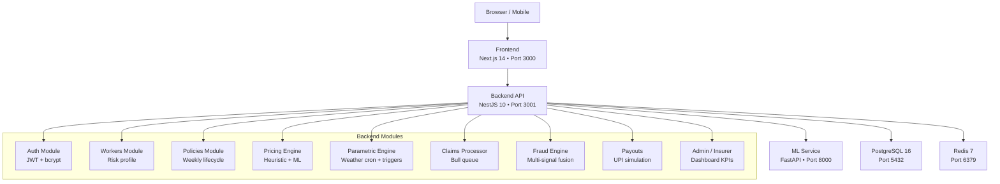
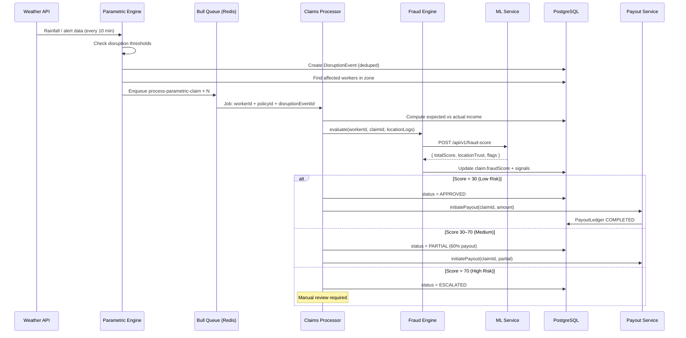

# AegisShield – System Architecture

## Overview

AegisShield is a microservice-based parametric income insurance platform consisting of 5 services coordinated via Docker Compose.



## Parametric Claim Flow



## API Contract Summary

| Service | Base URL | Key Endpoints |
|---------|----------|---------------|
| Backend | `localhost:3001/api/v1` | `/auth/*`, `/workers/*`, `/policies/*`, `/claims/*`, `/disruptions/*`, `/admin/*`, `/fraud/*` |
| ML Service | `localhost:8000/api/v1` | `/risk-score`, `/fraud-score`, `/disruption-predict`, `/location-trust` |
| Swagger UI | `localhost:3001/api/docs` | Full interactive API docs |

## Data Model Summary

```
User ──1:1──► Worker ──1:N──► Policy ──1:N──► Claim ──1:1──► PayoutLedger
                │                                │
                └──1:N──► FraudSignal            └──► DisruptionEvent
                └──1:N──► LocationLog
```
